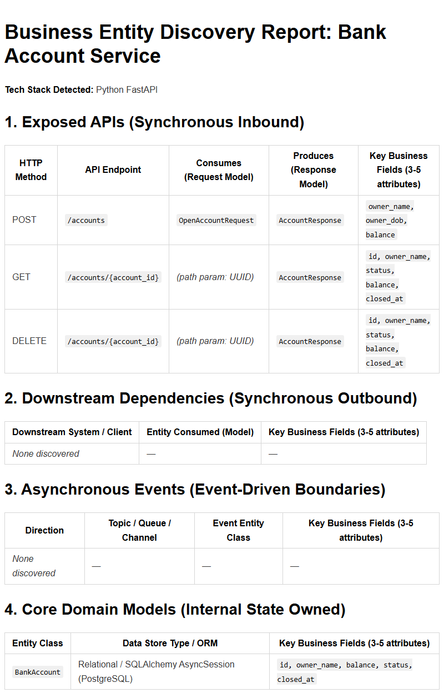

# Arch extension

This extension aimed to scan you project to gather infromation for enterprise architecture observability purpose.
It generates report file in Markdown format that contains:

- API
- business logic entities
- mapping of bussines entities to API

## Installation instruction

### For local installation

speckit install extension (to current project)

```bash

specify extension add --dev /path/to/this/extension
specify extension list

```

speckit remove extension (from current project)

```bash

specify extension remove arch

```

Full guide is [here](https://github.com/github/spec-kit/blob/main/extensions/EXTENSION-DEVELOPMENT-GUIDE.md)

## How to use

By default, extension configured to be called autmatically just after implementation task is completed.
You can change this behavior setting *"optional"* param of block *"hooks"* to *"true"* in configuration file **extention.yml**

## Example of report


